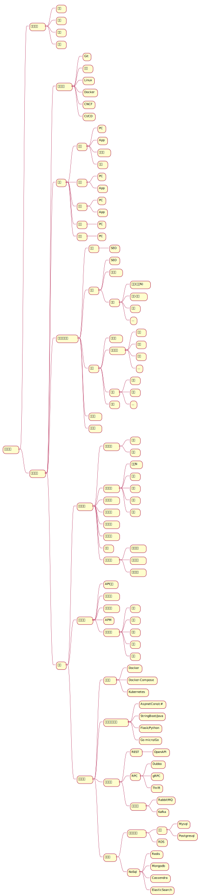
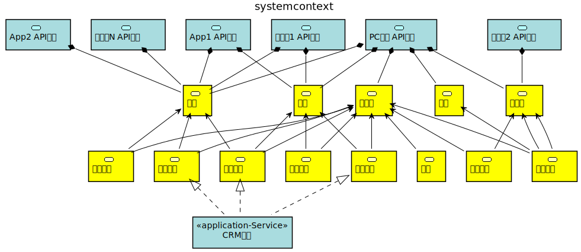
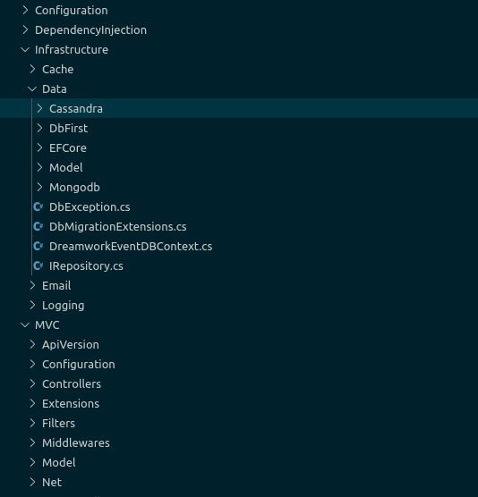
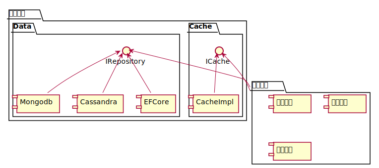
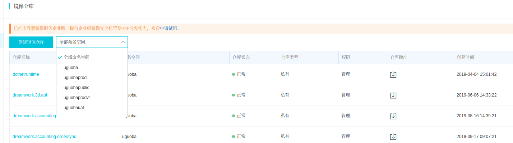
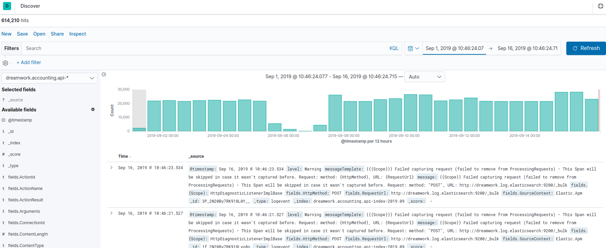
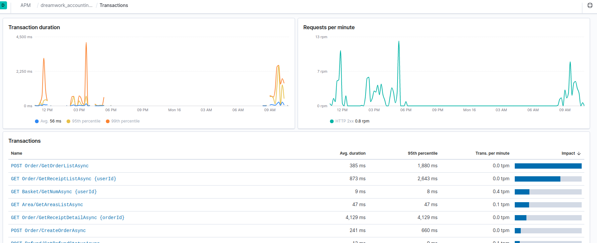

# Hello World - Dreamwork

```c#

 (Simple Life , Exercise Mind, Clean Code)
  => Dream World ;
```

# 在线教育微服务架构尝试-Microservice

打造一套基于云原生的微服务架构平台，能满足现有和将来的业务支撑，横向和纵向解耦业务/技术实现。能够持续集成新功能，能够保证现有业务的稳定迭代。
本文主要阐述下图中组件的基本职责,以及如何在整个平台中进行有效的构建和演进.

- **重要实践**
  主要阐述后端研发团队,运维应该具备的文化共识.
- **终端**
  这里的终端指代所有可访问整个平台服务的设备:PC,手机,平板,以及物联网设备.
- **前端**
  针对不同设备对外提供一致服务,浏览器访问的web网站,App访问的WebAPI等均属于前端服务,前端服务主要解决不同设备差异性封装,并聚合后端提供的基础服务.
- **后端**
  所有业务输出输入平台,按照微服务的原则进行边界划分,对外提供完整实现的服务.
- **业务**
    业务后端根据不同边界进行业务逻辑的实现,地位类似于阿里的中台,不过这是一个跟随时间和业务量逐步演变的过程,最初期主要体现为具有相对清晰边界的不同业务聚合,以构建具体的产品服务为己任.
- **技术**
    技术后端和业务后端的最主要区别在于技术后端并不直接参与构建产品服务层面的业务,更多的是提供安全性,高并发,高可用的支撑,监控和管理.
- **基础设施**
    基础设施偏重运行环境,程序构建,部署,通讯,持久化的规范和约束.
  

## 重要实践

### Git使用规范

  在开发,部署活动中所有代码,脚本必须在git中托管,不论是自建gitlab,还是平台服务,须严格执行git规范.

- 项目代码务必在git仓库托管
- 提交代码请参考[Angular Commit规范](https://github.com/angular/angular/blob/master/CONTRIBUTING.md)
- 了解并使用Git-Flow [GitFlow参考](https://zhuanlan.zhihu.com/p/66048537)

### 建立适合团队自身的敏捷开发方式

  Wiki[敏捷开发方法](https://zh.wikipedia.org/wiki/%E6%95%8F%E6%8D%B7%E8%BD%AF%E4%BB%B6%E5%BC%80%E5%8F%91)
  应该在团队内部建立共识,进行敏捷开发常识普及并集体制定适合本团队的规范方法.

### Linux

  开发团队强调对Linux的使用和依赖,借助Linux的开放性达成研发团队的共同语言符号,对所开发程序的底层操作系统有感性和理性的认知.另外需要了解目前Linux是对docker支持最友好的操作系统.

### Docker

  [Wiki简介](https://en.wikipedia.org/wiki/Docker_(software)

  研发团队须了解目前Docker已经是的大多数软件交付事实上的标准,目前绝大多数软件产品均提供Docker镜像的发布方式,能够极大避免环境配置,版本冲突等问题.尤其是服务端可以快速部署,快速销毁.所以请养成交付标准Docker镜像的习惯.

### CNCF

  [CNCF](https://www.cncf.io)
  以及[CNCF Landscape](https://zhuanlan.zhihu.com/p/68881339)

### CI/CD

  CI/CD（持续集成和持续发布）。创建CI/CD环境，从而使源代码上的任意修改，都能够自动通过容器进行编译、测试，并被部署到预生产甚至生产环境中

## 核心业务详解

### 简图



### 业务后端

根据微服务实践和对核心业务模型的分析,目前按照领域模型对核心业务进行如图拆分:

- 用户服务
  - 提供用户基本信息,
  - 认证,鉴权,可根据实际情况进一步分解为组件或者服务.
- 产品服务
  提供核心课程模型定义,按照领域模型进行建模如实表述业务逻辑,定义授课内容,形式,比如按照课程,课件等概念进行抽象.
  - 课程
  - 习题
  - 考试
    习题考试等内容可以进一步分解为题库中心/服务,均取决于业务要求.
- 订单服务
  - 订单服务
    提供完备和可扩展的订单中心,支持平台内所有订单行为.
  - 财务对账
  - 退费等支撑
  - 支付中心
    初期支付可在本服务实现,但是以组件形式解耦,后续可继续拆分出支付中心用来解耦第三方支付平台的对接.
- 市场服务
  - 定义各种促销活动的业务逻辑.
  - 其他市场策略
- 内容服务
  - 新闻资讯
  - SEO规范
  - 站内广告
  - 其它非产品类内容定义
- 学习服务
  - 提供用户学习活动基础业务逻辑抽象
  - 进行用户产品相关业务耦合.
- 日志
  - 业务日志
  - 行为日志
  - 其它级别日志
- 数据分析
  - 日志分析
  - 订单分析
  - 用户行为分析
  - 其它需要分析的模型

### 前端服务

前端业务对基本业务聚合,并输出具备相对完整功能集合用来支撑终端使用,这部分是相对易变的实现,会随着功能定义进行若干功能组合打包.

### 终端API

解决终端差异性,并提供restAPI接口,作为平台业务和终端链接的最终桥梁,是平台内提供对外服务的公网接口.

- 接口加解密
- 终端差异化业务实现.
  这部分内容最易变化,所有业务逻辑的变更均有可能导致此处发生更改.

## 技术后端

  提供非业务但必须实现的服务

- 公共组件库
    采用DIP原则开发抽象公共组件库,进行抽象定义,所有基础服务的业务逻辑实现只依赖抽象组件定义不依赖具体实现,外部组件的具体实现依赖抽象定义,采用依赖注入/控制翻转原则在程序入口耦合.
    
  
    上图目前定义的公共组件为目前微服务中所用
  
  - Configuration  配置组件
  
  - DependencyInjection 依赖注入入口定义
  
  - Cache 缓存
  
  - Data 定义若干数据库的Repository的抽象和实现
  
  - MVC 定义api服务的公共组件抽象和实现以及扩展
    
    ```csharp
      public interface ICache
      {
          Task<T> BindAsync<T>(string key,
              Func<Task<T>> operationGetData = null,
              DistributedCacheEntryOptions cacheEntryOptions=null,
              CancellationToken token = default) where T : class;
          Task RemoveAsync(string key,
            CancellationToken token = default);
          Task SetAsync<T>(string key, T value) where T : class;
          //... 其它方法定义
          Task<T> GetAsync<T>(string key) where T : class;
      }
    ```
    
    ```csharp
    public class Cache : ICache, IDisposable
    {
      private readonly ILogger<Cache> _logger;
      private readonly IDistributedCache _distributedCache;
      private readonly IConfiguration _configuration;
      private readonly ICacheActions _cacheActions;
    
      public Cache(ILogger<Cache> logger,
          IDistributedCache distributedCache,
          IConfiguration configuration,
          ICacheActions cacheActions)
      {
          _logger = logger;
          _distributedCache = distributedCache;
          _configuration = configuration;
          _cacheActions = cacheActions;
      }
      public async Task<T> BindAsync<T>(string key,
          Func<Task<T>> operationGetData = null,
          DistributedCacheEntryOptions cacheEntryOptions = null,
          CancellationToken token = default) where T : class
      {
          try
          {
              var byteCacheEntity = await _distributedCache.GetAsync(key, token);
              if (byteCacheEntity != null)
              {
                  var cacheEntity = 
                  JsonConvert.DeserializeObject<T>(Encoding.UTF8.GetString(byteCacheEntity));
                  return cacheEntity;
              }
    
              if (operationGetData == null) return null;
              var data = await operationGetData();
              await SetDistributedCacheAsync(key,
                      data, cacheEntryOptions);
              return data;
          }
          catch (StackExchange.Redis.RedisConnectionException ex)
          {
              _logger.LogError("Redis Connect Fail.", ex);
          }
          catch (Exception ex)
          {
              _logger.LogError("Get cached entity fail.", ex);
          }
    
          return await GetDataFromSource(operationGetData);
      }
    
        //... 其它实现定义
    
    }
    ```
    
    上图为缓存公共组件的抽象定义和它的一个实现
    
    上图为公共组件在其它微服务中的依赖

- 服务治理
    微服务部署由于Docker的引入可以最大程度降低环境复杂度的影响,但是由于服务绝对个数增多,带来一系列管理问题,需要一套完备的服务治理策略,从服务发现,注册,治理,监控需要一定的工作来保证.

- APM
    有效建立分布式调用链追踪,实时查看系统调用性能指标.

- 可以建立服务异常预警
    通过短信,邮件方式通知运维人员

- 应用日志
    采集并记录所有应用程序运行日志,这里推荐采用ELK平台,对日志的后续分析检索比较方便

- API网关
    提供API网关基础组件．

技术后端的内容会根据程序运行或者新业务的实现逐步更新维护，需要技术团队有一套常规计划来保证技术后端的有效，而且一定要在评估新的业务需求适合把隐性技术需求考虑进去，避免技术债越欠越多．

## 基础设施

定义若干基础设施在不同维度保证平台的稳定运行，并提供扩展能力

### 运行时

- Docker
  
  - 镜像编译
    每个应用跟随代码编写自己的Dockerfile,打包成标准Docker镜像,比如aspnet core程序可以按照如下格式:
  
  ```Dockerfile
  
  FROM registry.cn-qingdao.aliyuncs.com/uguobapublic/dotnetruntime AS base
  WORKDIR /app
  EXPOSE 80
  
  FROM registry.cn-qingdao.aliyuncs.com/uguobapublic/dotnetsdk AS build
  WORKDIR /src
  COPY Services/Auth/dreamwork.auth.api/ src/Services/Auth/dreamwork.auth.api/
  COPY BuildingBlocks/ src/BuildingBlocks/
  RUN dotnet restore src/Services/Auth/dreamwork.auth.api/dreamwork.auth.api.csproj
  
  WORKDIR /src/src/Services/Auth/dreamwork.auth.api
  RUN dotnet build dreamwork.auth.api.csproj -c Release -o /app
  
  FROM build AS publish
  RUN dotnet publish dreamwork.auth.api.csproj -c Release -o /app
  
  FROM base AS final
  WORKDIR /app
  COPY --from=publish /app .
  ENTRYPOINT ["dotnet", "dreamwork.auth.api.dll"]
  ```
  
  - 镜像仓库
    可以托管镜像到阿里云的容器镜像服务,国内各大平台基本都有提供服务,基础镜像可以共有,业务镜像可以设置私有
    
    

  镜像按照tag区分不同版本,功能
  比如:dreamwork.auth.api,dreamwork.auth.api:x.x,dreamwork.auth.api:dev_latest

- Docker Compose
  开发环境,测试环境可以使用 Docker Compose 进行容器编排,定义yaml文件组织服务,应用
  示例:
  
  ```yaml
  version: '3.4'
  
  services:
    dreamwork.apigateway.web:
      image: ${DOCKER_REGISTRY}/${DOCKER_REGISTRY_NAMESPACE}/dreamwork.apigateway.web:${VERSION_NUMBER}
      environment:
        - ASPNETCORE_ENVIRONMENT=${ASPNETCORE_ENVIRONMENT}
        - UseElastic=true
        - EnableAPIdoc=${EnableAPIdoc}
        - ElasticApm__LogLevel=Info
      ports:
        - "80"
      dns:
        - ${DNS_PROVIDER1}
        - ${DNS_PROVIDER2}
  
    dreamwork.web.portal:
      image: ${DOCKER_REGISTRY}/${DOCKER_REGISTRY_NAMESPACE}/dreamwork.web.portal:${VERSION_NUMBER}
      build:
        labels:
          dreamwork: "web"
        context: ../../src
        dockerfile: Terminal/Web/dreamwork.web.portal/Dockerfile
      environment:
        - ASPNETCORE_ENVIRONMENT=${ASPNETCORE_ENVIRONMENT}
        - UseElastic=true
        - EnableAPIdoc=${EnableAPIdoc}
        - APIGateway=http://dreamwork.apigateway.web/
        - "80"
      dns:
        - ${DNS_PROVIDER1}
        - ${DNS_PROVIDER2}
  ```
  
  以上定义了web网站的api网关,同时定义了web网站,在集成,测试服务器可以方便地使用一条docker compos命令快速启动服务,所有应用服务均可以采用此种方式快速验证,快速销毁,更方便的是基础设施的测试验证.
  
  ```yaml
    dreamwork.data.mysql:
      image: registry.cn-qingdao.aliyuncs.com/uguobapublic/dreamwork.mysql:latest
      command: --default-authentication-plugin=mysql_native_password --character-set-server=utf8mb4 --collation-server=utf8mb4_unicode_ci  --lower_case_table_names=1
      ports:
        - 5306:3306
      restart: always
      environment:
        MYSQL_ROOT_PASSWORD: ******
      volumes:
        - /var/lib/dreamwork/mysql/data:/var/cd /mysql
  
    dreamwork.data.cache.redis:
      image: ${DOCKER_REGISTRY}/${DOCKER_REGISTRY_NAMESPACE}/dreamwork.data.cache.redis:${VERSION_NUMBER}
      build:
        context: ./dockerconfig/Data/cache/redis/
        dockerfile: Dockerfile
      restart: always
      ports:
        - 6379:6379
      dns:
        - ${DNS_PROVIDER1}
        - ${DNS_PROVIDER2}
  ```
  
  以上配置快速定义了一个mysql和redis服务,并且redis在获取到公共镜像后能从配置脚步中加载自定义配置.

- Kubernetes=k8s
  
  对于Kubernetes的使用会牵涉到方方面面,内容及其繁杂,此处仅做简单说明.

### 开发框架,语言

- AspnetCore/C#

- StringBoot/Java

- Flask/Python

- Go micro/Go

### 服务通信

#### REST

- OpenAPI
- GraphQL

#### RPC

- Dubbo
- gRPC
- Thrift

#### 异步消息

- RabbitMQ
- Kafka

### 持久化

#### RDBMS

- MySql
- Postgresql
- LegacyDb(MSSqlServer,Oracle)

#### NoSql

##### Redis

##### Mongodb

##### Canssandra

##### Elasticsearch

###### 简介

ELK是三个开源软件的缩写，分别为：Elasticsearch 、 Logstash以及Kibana , 它们都是开源软件。不过现在还新增了一个Beats，它是一个轻量级的日志收集处理工具(Agent)，Beats占用资源少，适合于在各个服务器上搜集日志后传输给Logstash，官方也推荐此工具，目前由于原本的ELK Stack成员中加入了 Beats 工具所以已改名为Elastic Stack。

  Elastic Stack包含：

- Elasticsearch是个开源分布式搜索引擎，提供搜集、分析、存储数据三大功能。它的特点有：分布式，零配置，自动发现，索引自动分片，索引副本机制，restful风格接口，多数据源，自动搜索负载等。详细可参考Elasticsearch权威指南

- Logstash 主要是用来日志的搜集、分析、过滤日志的工具，支持大量的数据获取方式。一般工作方式为c/s架构，client端安装在需要收集日志的主机上，server端负责将收到的各节点日志进行过滤、修改等操作在一并发往elasticsearch上去。

- Kibana 也是一个开源和免费的工具，Kibana可以为 Logstash 和 ElasticSearch 提供的日志分析友好的 Web 界面，可以帮助汇总、分析和搜索重要数据日志。

###### 应用

- 统一日志平台，所有微服务，应用日志可以采用SerialLog，Logstash，beats方式记录日志到Elasticsearch,然后借助Kibana进行查询,检索甚至建立图标进行分析
  
  

- APM
    使用ElasticSearch可以使用其提供的APM功能,每个应用使用封装的Elastic.Apm.NetCoreAll实现APM监控
  
  

### Service Mash

## 规划

### 第一阶段

- 研发团队规范，共识
- 依赖注入、控制反转贯彻
- 无状态程序架构
- 接口规范，rest，RPC接口规范定义
- Docker程序编译打包
- Docker-Compose单点，多点部署
- Kubernetes集群验证
- 研发，测试，运维Devops流程建设

### 第二阶段

- 服务拆分
- API网关建设
- 服务发现、注册
- APM
- 缓存最佳实践

### 第三阶段

- CQRS
- DDD
- 消息队列引入
- 服务治理，监控，健康检查
- Kubernetes最佳实践
- 数据库多模式集群最佳实践

### 第四阶段

- 分布式事务
- 灰度发布
- A/B测试
- 服务网格
- 自动化测试完备
- 全链路压测
- 服务治理完备

### 第...阶段

- **完备微服务平台**
